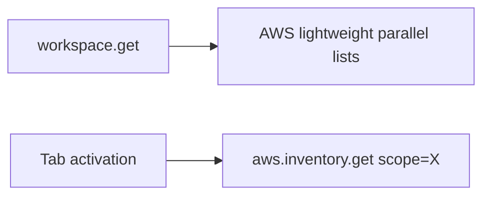

# AWS Services Expansion Plan

**Status:** Phase 1 merged to `dev` (PR #69, unreleased); Phase 2+ next
**Date:** 23 June 2026 (Phase 1 status updated 4 July 2026)
**Scope:** Add high-value AWS services to match Azure breadth, reusing v0.8.10 AWS performance patterns.

---

## Current AWS surface (v0.8.11)

| Tab | Service | Backend enricher | Adapter |
|-----|---------|------------------|---------|
| S3 | Object storage | `enrichS3Inventory` | `awsadapter/s3.go` |
| EC2 | Compute | `enrichEC2Inventory` | `awsadapter/ec2.go` |
| Lambda | Functions | `enrichLambdaInventory` | `awsadapter/lambda.go` |
| DynamoDB | NoSQL | `enrichDynamoDBInventory` | `awsadapter/dynamodb.go` |
| SQS | Queues | `enrichSQSInventory` | `awsadapter/sqs.go` |
| SNS | Topics | `enrichSNSInventory` | `awsadapter/sns.go` |
| RDS | Databases | `enrichRDSInventory` | `awsadapter/rds.go` |
| Logs | CloudWatch Logs | `enrichLogsInventory` | `awsadapter/logs.go` |
| IAM | Roles/policies | `enrichIAMInventory` | `awsadapter/iam.go` |

**Performance patterns already in place:** parallel enrichers on `workspace.get`, `lightweightAWS` drill-down deferral, `awsScope` on selection handlers, SWR resource cache, mutation cache bust.

---

## Gap analysis

Operators commonly need these AWS services next, in priority order:

| Priority | Service | User value | Complexity |
|----------|---------|------------|------------|
| P1 | **ECS / Fargate** | Container fleet visibility | Medium (clusters, services, tasks) |
| P1 | **API Gateway** | REST/HTTP API inventory + stage config | Medium |
| P1 | **Secrets Manager** | Secret metadata + reveal (write-gated) | Low |
| P2 | **EKS** | Cluster list + node group summary | High |
| P2 | **CloudFormation** | Stack list + events | Medium |
| P2 | **EventBridge** | Rules + buses | Medium |
| P3 | **Route 53** | Hosted zones + record preview | Medium |
| P3 | **ELB / ALB** | Load balancer inventory | Medium |
| P3 | **KMS** | Key list + alias metadata | Low |

---

## Architecture (mirror Azure lazy load)

Apply the same deferred pattern introduced for Azure in v0.8.11:

| Layer | Change |
|-------|--------|
| `workspace.go` | `awsDeferredInventory` for AWS open (regions + account context only) |
| New RPC | `aws.inventory.get` with scope per service tab |
| `aws_enrichment.go` | Add enrichers + scopes for new services |
| `awsadapter/` | New SDK adapters per service |
| `workspace_tabs.go` | New tabs with icons |
| `lazy-views.tsx` | Lazy-loaded view components |

---

## Phased delivery

### Phase 1 — Foundation (v0.8.12)

**Goal:** Extensibility without slowing open.

1. `aws.inventory.get` RPC (parallel to `azure.inventory.get`)
2. `awsDeferredInventory` on `workspace.get` for AWS workspaces
3. Frontend tab-scoped fetch helper (`lib/aws-inventory.ts`)
4. Enricher interface template + test harness for scoped handlers

**Exit:** AWS open loads only S3 buckets + EC2 regions (or empty shell); other tabs fetch on demand.

### Phase 2 — P1 services (v0.8.13)

| Service | Scope key | List APIs | Drill-down |
|---------|-----------|-----------|------------|
| ECS | `ecs` | ListClusters | ListServices, ListTasks (selected cluster) |
| API Gateway | `apigateway` | GetRestApis, GetApis (v2) | GetStages (selected API) |
| Secrets Manager | `secrets` | ListSecrets | GetSecretValue (write-gated reveal) |

Each ships with:
- `awsadapter/<service>.go`
- `aws_<service>.go` enricher + selection handlers
- Desktop view under `views/workspace/`
- Workspace tab entry + nav count
- Scoped handler tests + SWR cache keys

### Phase 3 — P2 services (v0.8.14)

- EKS: `ListClusters`, `DescribeCluster`, node group summary
- CloudFormation: `DescribeStacks`, `DescribeStackEvents` (recent)
- EventBridge: `ListEventBuses`, `ListRules`

### Phase 4 — P3 + polish (v0.8.15)

- Route 53, ELB, KMS
- Cross-service links (e.g. API Gateway → Lambda integration ARN)
- Unified "service loading" UX matching Azure tab spinners

---

## Per-service implementation checklist

For each new AWS service:

- [ ] `awsadapter` List* methods with `withAWSTimeout`
- [ ] Resource cache scope + TTL + mutation invalidation
- [ ] `enrichAws*` with `lightweight` branch
- [ ] `awsScope` case in `enrichAwsScoped`
- [ ] Selection handlers return `WorkspaceSnapshot` via `finishAWSWorkspaceOpts`
- [ ] `service.go` RPC registration
- [ ] `backend.ts` mock handler
- [ ] TypeScript types in `types/backend.ts`
- [ ] Lazy view + `App.tsx` wiring
- [ ] `workspace_tabs.go` tab definition
- [ ] Vitest view test + Go handler test

---

## Performance guardrails

1. **Never add serial enricher chains** — all full-load paths stay parallel
2. **Scoped handlers only touch one service** — regression test per scope
3. **SWR on every list API** — 30–60s TTL, bust on create/delete
4. **Lightweight default** — lists on tab open, drill-down on selection only
5. **`go test -race`** on parallel enricher changes

---

## Success metrics

| Metric | Target |
|--------|--------|
| AWS workspace open (deferred) | < 10s |
| New service tab first load | < 15s scoped |
| `workspace.get` AWS call count on open | ≤ 3 |
| Bundle impact per new view | < 30 KB lazy chunk |

---

## PR stack (proposed)

| PR | Branch | Content |
|----|--------|---------|
| 1 | `feat/aws-deferred-inventory` | `aws.inventory.get` + deferred open |
| 2 | `feat/aws-ecs` | ECS tab + adapter |
| 3 | `feat/aws-apigateway` | API Gateway tab |
| 4 | `feat/aws-secrets` | Secrets Manager tab |
| 5+ | `feat/aws-*` | P2/P3 services |

Stack merges to `dev` with fast-forward; tag per release (`v0.8.12`, `v0.8.13`, …).