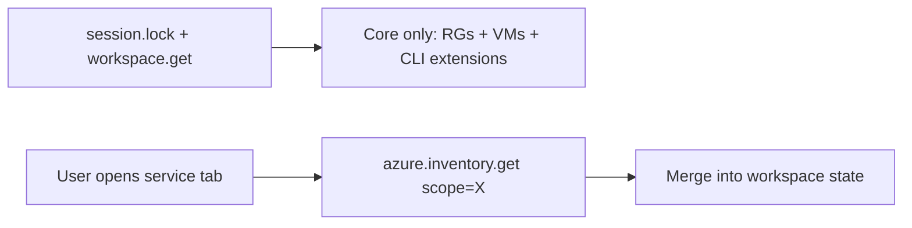

# Azure Load Performance Plan

**Status:** Implemented in `perf/azure-lazy-v0.8.11` (v0.8.11)  
**Date:** 23 June 2026  
**Scope:** Lazy per-service Azure inventory, lightweight fixes, SWR extension, phase-2 parallelism, instrumentation hooks.

---

## Problem statement

Opening an Azure workspace takes ~60–120+ seconds because `workspace.get` loads **every** Azure service in one blocking IPC round-trip, mostly via serial `az` CLI subprocesses. AWS feels much faster because v0.8.10 parallelised enrichers, defers drill-down in lightweight mode, and uses the in-process AWS SDK.

Azure has partial mitigations (`lightweightAzure`, `azureScope` on selection handlers) but the initial load still runs all enrichers plus a **serial phase 2** (App Service detail, queues, WAF, Front Door topology).

---

## Root causes (evidence)

| # | Issue | Location |
|---|--------|----------|
| 1 | Monolithic `workspace.get` loads all Azure services | `session.go` → `buildWorkspaceSnapshotOpts` → `enrichAzureWorkspace` |
| 2 | Phase 2 enrichers run serially | `azure_enrichment.go:75–83` |
| 3 | Lightweight gaps: Front Door full topology, web app detail on open | `azure_frontdoor.go`, `azure_webapps_detail.go` |
| 4 | `enrichAzureInventory` bypasses SWR for resource groups | `azure.go:117` vs `azureResourceGroups()` |
| 5 | Most Azure list APIs lack TTL SWR | Only storage + `azureResourceGroups()` helper |
| 6 | `az` subprocess per call vs AWS SDK | `azureadapter/inventory.go` |
| 7 | No runtime call/latency instrumentation | Phase 0 deferred from v0.8.10 plan |

**Estimated calls on Azure open today:** ~18–25 `az` invocations (10 parallel + 8–13 serial).

---

## Target architecture

| Phase | `workspace.get` (Azure) | Tab activation |
|-------|-------------------------|----------------|
| Before | All 12 services | Blocked until full snapshot |
| After | Core only (~2 calls) | Scoped fetch per tab (~1–4 calls) |

---

## Implementation phases

### Phase 0: Instrumentation (shipped in v0.8.11)

- Enricher duration logs in `enrichAzureWorkspace` when `CLOUDSPROCKET_AZURE_PROFILE=1` or test hook
- `azure.inventory.get` returns same snapshot shape as scoped handlers (frontend merge helpers)

### Phase 1a: Deferred Azure inventory on `workspace.get`

- Add `azureDeferredInventory` to `workspaceSnapshotOptions`
- Azure `workspace.get` sets `azureDeferredInventory: true` → only `enrichAzureInventory`
- **Target:** open in 5–15s (2–3 calls + discovery/Docker)

### Phase 1b: `azure.inventory.get` RPC

- Params: `{ "scope": "storage" | "webapps" | ... }`
- Runs `buildWorkspaceSnapshotOpts` with `azureScope` + `skipAwsInventory` + `lightweightAzure: true`
- New scopes: `loganalytics`, `entra`
- Webapps scope: skip `enrichAzureWebAppDetail` when lightweight

### Phase 1c: Lightweight fixes

- Front Door: profiles only in lightweight; defer endpoints/origins/groups to tab refresh or selection
- Phase 2: skip web app detail when `opts.lightweight`
- `enrichAzureInventory` uses `azureResourceGroups()` SWR path

### Phase 1d: Parallelise Azure phase 2 (full builds only)

- App Service + detail chain, queues, WAF, Front Door run concurrently with mutex (mirror phase 1)

### Phase 1e: Frontend tab-triggered fetch

- Map tab IDs → Azure scopes
- `useEffect` on `activeWorkspaceTabId` calls `azure.inventory.get` once per scope per session
- Storage nav badge uses account count when containers empty
- WAF/Front Door tab effects remain for drill-down/detail only

### Phase 2 (deferred): Progressive snapshots

- `workspace.patch` events or streaming partial updates
- Background SWR refresh after cache hit

---

## Tab → scope mapping

| Tab ID | Scope | Notes |
|--------|-------|-------|
| `azure-overview`, `azure-resource-groups`, `azure-vms` | _(core)_ | Loaded on `workspace.get` |
| `azure-storage` | `storage` | List accounts only until account select |
| `azure-app-service` | `webapps` | List apps; detail on app select |
| `azure-log-analytics` | `loganalytics` | Workspace list |
| `azure-waf` | `waf` | Policy list; detail via existing refresh |
| `azure-front-door` | `frontdoor` | Profiles; topology via refresh |
| `azure-functions` | `functions` | |
| `azure-key-vault` | `keyvault` | |
| `azure-cosmos` | `cosmos` | |
| `azure-queues` | `queues` | |
| `azure-entra` | `entra` | |

---

## Success metrics

| Scenario | Before (est.) | Target |
|----------|---------------|--------|
| Azure workspace open | 60–120s | 5–15s |
| First visit to Storage tab | Blocked + 20–30s | 5–10s scoped |
| Revisit tab within 60s SWR | Cold | Sub-second |
| `az` calls on open | 18–25 | 2–3 |

---

## Test plan

- `TestWorkspaceGetAzureDeferredLoadsCoreOnly` — deferred get runs RG/VM only
- `TestAzureInventoryGetScoped` — scope runs single enricher family
- `TestAzurePhaseTwoParallel` — race-safe parallel phase 2 (existing pattern)
- Update `TestWorkspaceGetSkipsHeavyAzureDrillDown` for deferred behaviour
- Desktop: tab switch triggers scoped fetch mock assertion

---

## PR plan

Single PR `perf/azure-lazy-v0.8.11` → `dev`, tag `v0.8.11`.