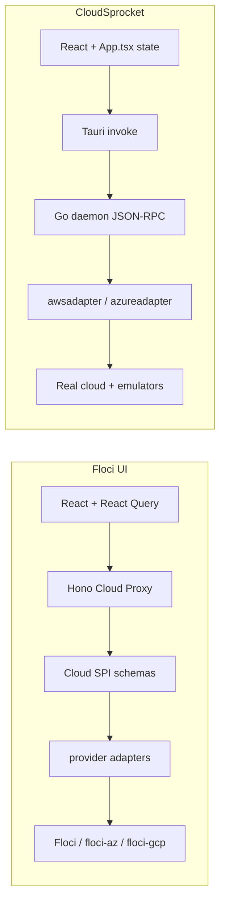

# Floci UI inspiration notes

**Date:** 3 July 2026 (validated against both codebases and the live floci API on 4 July 2026; implementation order revised)  
**Source:** [floci-io/floci-ui](https://github.com/floci-io/floci-ui) at `D:\Dev\floci-ui`  
**Running locally:** Docker Compose on http://localhost:4500 (UI) + http://localhost:4501 (API)

Floci UI is Floci's local cloud console: a web app with a Cloud Proxy API over Floci / floci-az / floci-gcp. CloudSprocket is a Tauri desktop workbench with a Go sidecar, real-cloud + local profiles, and OpenTofu deploy. The products overlap on local emulator UX but differ in scope and architecture.

---

## What Floci UI does well

### 1. Metadata-driven shell (Cloud SPI)

The API exposes a **service schema** per cloud + category:

```
GET /api/clouds/aws/services/storage/schema
→ fields, columns, filters, actions, capabilities
```

The frontend renders one shell for every provider:

- `DynamicResourceView` — table + inspector + actions
- `DynamicFormRenderer` — create forms from field schema
- `StorageObjectBrowser` — prefix navigation, upload/download/copy/delete/folder

Provider differences live in **adapters** (`adapter-aws`, `adapter-azure`, `adapter-gcp`), not in bespoke React pages per service.

### 2. Category navigation (cloud-agnostic)

Sidebar groups by **capability**, not vendor service name:

| Category | AWS | Azure | GCP |
|----------|-----|-------|-----|
| Storage | S3 | Blob | GCS |
| Database | RDS | Cosmos NoSQL | — |
| Compute | EC2 | Soon | Soon |
| Networking | VPC | Soon | Soon |
| Serverless | Lambda | (registered, nav TBD) | (adapter exists, nav TBD) |
| k8s | EKS | Soon | Soon |

Unavailable items show an explicit **Soon** badge instead of missing pages or fake data.

### 3. Capability gating

`capabilities.ts` normalises action availability:

- `available` / `blocked` / `partial` / `coming_soon`
- Actions can require a reachable runtime (`runtimeRequired`)
- UI disables buttons with a reason when LocalStack/floci is down

This is cleaner than CloudSprocket's write-mode toggle alone.

### 4. TanStack Query everywhere

Each view fetches scoped data:

- `useQuery` for schema, resources, objects
- `useMutation` + `invalidateQueries` on create/delete
- `AbortSignal` on navigation
- Polling tiers: runtime status every 5s (`Layout.tsx`), Console Home every 10s, resource lists every 30s

No monolithic snapshot; tab switches do not reload unrelated inventory.

Caveat for CloudSprocket: floci-ui gets React Query cheaply because its API is stateless REST reads. CloudSprocket's sidecar is stateful (selection handlers such as `aws.s3.selectBucket` mutate server-side session state and return full snapshots into one `workspace` object in a ~4,900-line `App.tsx`). Adopting React Query before decomposing `App.tsx` would create two competing state systems. See revised order below.

### 5. Console Home

`/console/:cloud` shows:

- Runtime reachability (Connected / Not connected)
- Summary tiles (cloud, runtime, active services, resource count)
- Architecture flow strip (UI → Proxy → Adapter → Runtime)
- Service cards with counts — click through to Cloud Explorer

### 6. Rich local workflows (AWS)

Beyond the generic shell, provider-specific panels where needed:

- **VPC wizard** — multi-step subnet CIDR layout
- **Networking panel** — IGW, NAT, route tables, security groups
- **Cosmos NoSQL panel** — databases, containers, documents, SQL query editor
- **Secrets Manager** — dedicated page (transitioning into Cloud Explorer)

### 7. Honest surface area

Placeholders are visible: "Soon" badges in the nav (`Layout.tsx`) and cloud selector, "Coming Soon" states in `DynamicResourceView`. No mock rows in normal mode.

### 8. Request telemetry

`requestEventBus` publishes API request events for debugging latency and failures.

---

## Where CloudSprocket is ahead

| Area | CloudSprocket | Floci UI |
|------|---------------|----------|
| Real cloud profiles | AWS + Azure production reads/writes (gated) | Local emulators only |
| Azure breadth | 13 service tabs + WAF / Log Analytics / Front Door tools | Storage + Cosmos + placeholders |
| Deploy | 23 OpenTofu recipes, plan/apply in-app | None |
| Emulator ops | Start/stop/recreate LocalStack + floci-az, logs, contract checks | Assumes runtime already up |
| Desktop | Tauri, offline-capable, native dialogs | Web + Docker |
| AWS service tabs | 9 dedicated tabs with deep UX (presign, peek, etc.) | Category shell + AWS panels |

CloudSprocket should borrow **patterns**, not replace its strengths.

---

## Gap analysis (actionable)

### High value, fits current architecture

| Idea | Floci UI pattern | CloudSprocket today | Suggested change |
|------|------------------|---------------------|------------------|
| Scoped data fetching | React Query per resource list | `workspace.get` runs all nine AWS enrichers on open; `azure.inventory.get` already defers Azure per tab | Extend the proven `azure.inventory.get` pattern to AWS (`aws.inventory.get`). No TanStack Query needed for this: the backend switch (`enrichAwsScoped` in `aws_enrichment.go`) already exists |
| Resource table + inspector | Shared layout in `DynamicResourceView` | Each view rebuilds tables/detail panels | Extract `ResourceTable` + `ResourceInspector` primitives, frontend only; migrate S3/Azure Storage first. Do NOT normalise backend types into a generic `CloudResource` shape |
| Capability metadata | Schema declares enabled actions | Coarse flags exist (`AWSWriteCapable`, `AWSWritesEnabled`, `AzureWriteCapable` in `workspace.go`); per-action gating is hard-coded per view | Extend Go handlers to return per-action `capabilities[]` with disabled reasons; one frontend helper unifies write-mode, profile and runtime-reachability gates |
| Console Home richness | Runtime flow + service cards with counts | `OverviewView` has stats but no runtime strip | Add emulator health strip + "open tab" service cards on Overview |
| Explicit "Soon" nav | Disabled nav + badge | GCP tab exists but thin | Show upcoming GCP tabs as disabled with Soon badge |
| Object browser parity | Copy, folder prefix, bulk delete | S3/Azure upload + delete | Add copy + folder-prefix create to storage views |

### Medium value, larger effort

| Idea | Notes |
|------|-------|
| Category-based nav | Group S3 + Azure Storage under "Storage" — big IA change; consider hybrid (keep tabs, add category grouping in Overview) |
| Schema-driven create forms | `DynamicFormRenderer` — backend would need field schemas per create RPC |
| VPC wizard | Port wizard UX for LocalStack EC2 networking — high value for local dev |
| Cosmos query editor | Floci's SQL panel is strong; CloudSprocket Cosmos tab is read-only browse |
| API request telemetry | Mirror `requestEventBus` for Tauri `invoke` timing in debug mode |

### Low priority / different product

| Idea | Why skip or defer |
|------|-------------------|
| HTTP Cloud Proxy layer | Go JSON-RPC + Tauri IPC is correct for desktop |
| Replace per-service tabs entirely | Too disruptive; Azure tools (WAF, LA) do not fit a generic shell |
| Local-only scope | CloudSprocket's real-cloud support is a differentiator |

---

## Implementation order (revised 4 July 2026 after codebase validation)

Two findings changed the sequencing:

1. `enrichAwsScoped` (`backend/daemon/internal/app/aws_enrichment.go`) already has the full per-service switch, and every AWS selection handler already passes `awsScope`. Deferred AWS inventory is therefore a single PR mirroring `azure_inventory.go` (67 lines) and `lib/azure-inventory.ts` (132 lines), not a phase gated on a new data layer.
2. TanStack Query does not fit the current stateful sidecar + monolithic `App.tsx`. It moves behind the `App.tsx` decomposition (performance plan Phase 3b).

### Step 1 — Deferred AWS inventory (one PR, no new dependencies)

**Status:** Shipped in v0.8.23 (PR #69).

Matches `docs/aws-services-expansion-plan.md` Phase 1. File-level scope:

- New `backend/daemon/internal/app/aws_inventory.go`: scope validation + snapshot build with `awsScope` + `skipAzureInventory`, mirroring `azure_inventory.go`
- `backend/daemon/internal/app/service.go`: add `case "aws.inventory.get"` (next to `azure.inventory.get`)
- `backend/daemon/internal/app/workspace.go`: add `awsDeferredInventory` option alongside `azureDeferredInventory`; set it in `session.go` (~line 192) and `jobs.go` (~line 75)
- New `apps/desktop/src/lib/aws-inventory.ts`: tab-to-scope map + loaded check, mirroring `azure-inventory.ts`
- `apps/desktop/src/App.tsx`: fetch-on-tab-activation wiring, copying the `azureInventoryFetchedScopesRef` pattern (~line 1706)
- `apps/desktop/src/lib/backend.ts`: mock handler for `aws.inventory.get`
- Tests: extend `workspace_aws_test.go` (deferred get runs no AWS enrichers; scoped get runs exactly one) and `App.test.tsx`

**Exit:** AWS workspace open fetches no per-service inventory; each tab loads its own service on first activation, matching Azure behaviour. Estimated 400-600 lines across 6-8 files.

### Step 2 — Overview polish + honest surface area (one PR)

**Status:** Shipped in v0.8.23 (PR #70).

1. `OverviewView`: runtime health strip (Docker + LocalStack + floci-az reachability, reusing `runtime.get` data), emulator quick actions, service cards with click-through to tabs
2. GCP nav entries disabled with a "Soon" badge instead of a thin placeholder

**Exit:** Overview is the landing hub; nothing in the nav pretends to work.

### Step 3 — Per-action capabilities (one to two PRs)

**Status:** Shipped in v0.8.23 (PRs #71–#73): `ActionCapability` model + AWS metadata (#71), AWS + core Azure view wiring (#72), Azure tools write gates (#73).

1. Go handlers return `capabilities[]` per service (action, enabled, reason), building on the existing `AWSWriteCapable` / `AzureWriteCapable` flags
2. One frontend helper replaces the per-view write-mode conditionals; disabled buttons show the reason (write mode off, real-cloud profile, runtime down)

**Exit:** Buttons explain why they are disabled, consistently across AWS tabs, Azure tabs and Azure tools.

### Step 4 — App.tsx decomposition, then the TanStack Query decision

**Status:** Structurally done, exit criterion not yet met. 4a snapshot/shell extraction (#74, v0.8.23), 4b session/loading hooks (#75), 4c IPC-boundary normalisation (#76, completes perf Phase 3c), 4d tab routers + `useWorkspaceState` + `useVirtualisationPoll` (#77), all in v0.8.24. `App.tsx` is at 2,891 lines; the remaining trim and the React Query decision are the next execution target below.

1. Performance plan Phase 3b: extract `useWorkspaceState`, `useSessionState`, per-provider tab routers from `App.tsx` (~4,900 lines)
2. Phase 3c while in there: normalise snapshots once at the IPC boundary
3. Only then evaluate TanStack Query, starting with genuinely idempotent reads (`runtime.get` polling, logs, `deployments.list`), not selection handlers

**Exit:** `App.tsx` under ~1,500 lines; a deliberate yes/no on React Query with a narrow pilot.

### Step 5 — Shared inventory shell (frontend only)

**Status:** Shipped pre-v0.9 (v0.8.28–v0.8.32 ResourceTable rollout; CloudFormation + EventBridge migrated on `feat/pre-v09-backlog`).

1. `ResourceTable` + `ResourceInspector` components (match Floci's split-pane)
2. Migrate AWS S3 buckets view and Azure Storage to the shared shell
3. Keep the typed snapshot fields; no backend `CloudResource` normalisation

**Exit:** All AWS inventory tabs and Azure Storage share one layout; less duplicated table code.

### Step 6 — Depth workflows

**Status:** Partial — S3 copy + folder prefix and Azure blob copy + folder prefix shipped pre-v0.9. Cosmos SQL and VPC wizard remain.

Pick high-impact Floci flows to port:

- S3/Azure object copy + folder-prefix create — **shipped pre-v0.9**
- Cosmos SQL query panel (CloudSprocket's Cosmos tab is read-only browse today)
- VPC wizard: only after AWS networking tabs exist (see expansion plan P2/P3)
- GCP storage tab (when floci-gcp support is wired)

### Explicitly cut from the original plan

- Wrapping all of `backendRequest` in a query client (Step 1 of the old Phase 1): premature while the sidecar is stateful
- Backend `CloudResource` normalisation (old Phase 2.3): cross-cutting API change with mostly aesthetic benefit
- Category-based navigation: revisit only after Step 5, as an Overview grouping rather than a nav replacement

---

## Next execution targets (updated 5 July 2026, post v0.8.27)

Steps 1–4 shipped. Target A (handler hooks, #78) and Target B (AWS Phase 2, #79–#81) shipped in v0.8.25–v0.8.26. Service enablement Phases 1–3 shipped in v0.8.27 (#82). `App.tsx` is ~1,964 lines (exit criterion ~1,500 not met; remainder is app-shell logic).

### Target A — App.tsx handler extraction (branch `refactor/app-action-hooks`) — **shipped v0.8.25 (#78)**

The remaining bulk of `App.tsx` is per-service selection/mutation handlers. Extract them into hooks that take the shared dependencies (`backendRequest`, `setWorkspace`/`mergeWorkspace`, status setters, `startTransition`) and return the handler bundles the tab routers already consume via `workspace-tab-router-props.ts`:

1. `hooks/use-aws-actions.ts`: the AWS blocks at roughly `App.tsx` lines 1125–1690 (EC2, Lambda, DynamoDB, SQS, SNS, RDS, Logs, IAM refresh/select/mutate handlers plus `applyS3PrefixFilter`)
2. `hooks/use-azure-actions.ts`: the Azure blocks at roughly lines 679–1105 (web app/slot, VM, resource group, Front Door topology, WAF policy, Log Analytics workspace)
3. `hooks/use-runtime-actions.ts`: Docker/emulator handlers (`refreshDockerRuntime`, `refreshLocalStackLogs`, `refreshFlociAzLogs`, environment parsing helpers, roughly lines 1729–1950)
4. Keep behaviour identical: same RPC methods, same scoped snapshot merges, same status messages. No new dependencies

**Exit:** `App.tsx` at or under ~1,500 lines; all 179 Vitest tests still pass unchanged (behaviour-preserving refactor); `pnpm --filter @cloudsprocket/desktop test` and `go test ./...` green.

### Target B — AWS expansion Phase 2 (three PRs, after Target A merges) — **shipped v0.8.25–v0.8.26 (#79–#81)**

Per `docs/aws-services-expansion-plan.md` Phase 2 and its per-service checklist: `feat/aws-ecs`, then `feat/aws-apigateway`, then `feat/aws-secrets`. Each service: `awsadapter/<service>.go`, enricher + `enrichAwsScoped` case + `validAwsInventoryScopes` entry in `aws_inventory.go`, scope entry in `lib/aws-inventory.ts`, lazy view under `views/workspace/`, tab wiring through the Step 4d tab routers (`components/workspace/aws-workspace-tabs.tsx`), action capabilities for any write actions, tests per the checklist.

### Target C — TanStack Query decision (after Target A) — **spike shipped (branch `feat/tanstack-query-spike`)**

**Verdict: adopt narrowly** for idempotent read/poll paths only. Do not migrate workspace snapshot loading, session state, or mutation handlers to React Query.

**Pilot (implemented):**

| Surface | Before | After |
|---------|--------|-------|
| Local Runtime poll (`runtime.get` + emulator logs via `fetchVirtualisationSnapshot`) | `setInterval` in `use-virtualisation-poll.ts` | `useQuery` with `refetchInterval: 5000` when `virtualisation` tab active; existing `refreshVirtualisationState` remains the `queryFn` |
| Deploy recipe list (`deployments.list`) | `useState` + `useEffect` in `DeployView` | `useDeploymentsQuery` with cache updates on `deployment.changed` and delete |

**Infrastructure:** `@tanstack/react-query` 5.x, `AppProviders` (`QueryClientProvider` + `ThemeProvider`), `lib/query-keys.ts`, `lib/query-client.ts`.

**Decline for now:**

- `workspace.get` / locked-session inventory (complex scoped merges, preference gates, tab activation)
- AWS/Azure inventory scopes (`aws.inventory.get`, `azure.inventory.get`)
- Any write/mutation flow (keep imperative `backendRequest` + local status setters)

**Why narrow adoption wins:** removes hand-rolled polling and duplicate list-fetch boilerplate without fighting the existing workspace snapshot model. A full migration would duplicate state (query cache vs `useWorkspaceState`) and slow App.tsx decomposition.

**Next if adopted further:** `deployments.list` pattern for read-mostly logs tails only after measuring cache benefit; still no workspace migration.

### Service enablement (Phases 1–3) — **shipped v0.8.27 (#82)**

Hierarchical provider + service toggles via App menu → Services; disabled = fully dormant. Overview hidden-resources hint with one-click enable. See `docs/service-enablement-plan.md`. Phase 4 (onboarding wizard) deferred.

---

## Architecture comparison



**Takeaway:** Floci UI's SPI + schema layer is the main architectural lesson. CloudSprocket can adopt the *contract* (normalised resources, capabilities, scoped fetches) without replacing Tauri/Go.

---

## Quick reference — Floci UI local stack

```powershell
# Already running (docker ps):
# floci-ui-floci-ui-1   → :4500
# floci-ui-floci-api-1  → :4501
# floci-ui-floci-1      → :4566

curl http://localhost:4501/api/clouds
curl http://localhost:4501/api/clouds/aws/status
curl http://localhost:4501/api/clouds/aws/services/storage/schema
```

Source docs: `D:\Dev\floci-ui\docs\implementation-notes.md`, `README.md`.