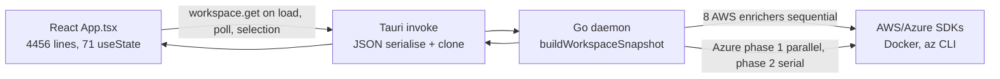

# CloudSprocket Performance Remediation Plan

**Status:** Implemented in `perf/v0.8.10` (v0.8.10)  
**Date:** 22 June 2026  
**Scope:** Phases 1a-1d, 2a-2c, 3a, 3d implemented. Phase 3b (App.tsx decomposition) and Phase 4 deferred.

---

## Problem statement

The application feels slow across startup, workspace lock, tab switching, AWS interactions, and the Local Runtime tab. Code analysis and a production build (`pnpm run build`) show this is systemic, not a single bug.

**Dominant pattern:** every interaction ships a monolithic `WorkspaceSnapshot` over Tauri IPC, and the Go daemon rebuilds far more cloud inventory than the UI needs. Azure has partial mitigations; AWS does not. The React shell compounds this with a 4,456-line `App.tsx`, no code splitting, and deep-clone normalisation on every update.

---

## Architecture (where time goes)



| Layer | Stack | Key files |
|-------|-------|-----------|
| Shell | Tauri 2 | `apps/desktop/src-tauri/src/main.rs` |
| Frontend | React 19 + Vite 8 | `apps/desktop/src/App.tsx`, `apps/desktop/src/lib/backend.ts` |
| Backend | Go daemon + SQLite | `backend/daemon/internal/app/workspace.go`, `backend/daemon/internal/app/session.go` |

---

## Root causes (ranked by evidence)

### 1. AWS always rebuilds all 8 services (critical)

Azure selection handlers use scoped enrichment (`azureScope`, `skipAwsInventory`). AWS handlers call `finishAWSWorkspace` which runs full `buildWorkspaceSnapshot` with no scoping.

- `backend/daemon/internal/app/aws_session.go:41-50` — `finishAWSWorkspace` has no options
- `backend/daemon/internal/app/azure_session.go:54-63` — `finishAzureWorkspaceOpts` passes scoped options
- Every `aws.ec2.selectRegion`, `aws.s3.setPrefixFilter`, `aws.lambda.selectFunction`, etc. triggers all 8 AWS enrichers

**Example:** S3 prefix typing debounces at 350ms (`StorageView.tsx:212,234-239`) but each pause still triggers a full rebuild.

### 2. AWS enrichers run sequentially (critical)

`workspace.go:118-128` — S3, EC2, Lambda, DynamoDB, SQS, SNS, RDS, Logs, IAM run one after another. Azure phase 1 runs in parallel goroutines (`azure_enrichment.go:64-72`). Each AWS call has a 30s timeout (`aws_common.go:18-24`).

### 3. Local Runtime tab polls `workspace.get` every 5s (high)

`App.tsx:1166-1176` — when the virtualisation tab is active, `refreshVirtualisationState` fires every 5s (`App.tsx:2254-2267`):

- `workspace.get` (full snapshot)
- `emulators.logs` x 2

Backend comments in `session.go:182-185` and regression test `TestUnlockNotBlockedBySlowWorkspaceFetch` (`service_test.go:1493`) confirm this path has caused contention.

**Current load:** at least 12 `workspace.get` + 24 log fetches per minute with tab open.

### 4. Resource cache is error-only, not freshness (high)

`aws_s3.go:84-106` — live API on every success; SQLite cache only on failure. `fetched_at` is stored (`backend/daemon/internal/store/sqlite.go:163-217`) but never checked for staleness; `LoadResourceCache` returns it only to build a "Cached …" summary string. Same pattern across EC2, Lambda, Azure services.

### 5. `discovery.Discover()` on nearly every RPC (medium)

`discovery.go:73-88` — scans AWS/Azure/GCP config + CLI probes. Called from `providers.list`, `session.get`, `profiles.list`, `workspace.get`, and most mutation handlers. Startup alone: at least 4 full discoveries. No in-process cache.

### 6. Frontend monolith and large bundle (medium)

| Evidence | Value |
|----------|-------|
| `App.tsx` lines | 4,456 |
| `useState` hooks | 71 |
| `React.lazy` usage | None |
| Main JS chunk | 868 KB (221 KB gzip). Vite warns >500 KB |
| Static imports | 20+ workspace views (`App.tsx:76-106`) |
| Vite chunks | Only `tauri` + `react-vendor` (`vite.config.ts:16-27`) |

### 7. `normaliseWorkspaceSnapshot` on every update (medium)

`App.tsx:679-771` — deep-clones every inventory array. Called ~89 times in `App.tsx` on each IPC response.

### 8. Large tables without virtualization (medium)

`LogQueryResultPanel.tsx` renders up to 5,000 rows via `.map()` (`backend/daemon/internal/azureadapter/loganalytics.go:30`, `DefaultLogAnalyticsMaxRows = 5000`). Inventory views (`ComputeView`, `LambdaView`, etc.) have the same pattern. No virtualization library (`@tanstack/react-virtual`, `react-window`) is currently installed.

### 9. Full payload over IPC (medium)

Each `workspace.get` serialises the entire snapshot in Go, clones in Tauri (`main.rs:178-179`), deserialises in frontend, and logs full payload in debug mode (`backend.ts:3128-3134`).

---

## What already works (preserve and extend)

| Pattern | Location | Benefit |
|---------|----------|---------|
| `lightweightAzure` on `workspace.get` | `session.go:192-196` | Skips expensive Azure drill-down on initial load |
| `azureScope` on selection handlers | `azure_enrichment.go:86-113` | Only refreshes one Azure service per action |
| `skipAwsInventory` for Azure RPCs | `workspace.go:23-25` | Azure mutations skip AWS re-fetch |
| Mutex released before snapshot build | `session.go:186-188` | Unlock not blocked by slow builds |
| Docker unreachable cache (15s TTL) | `docker.go:30-52` | Avoids probe timeout storms |
| `startTransition` for state updates | Throughout `App.tsx` | UI stays responsive during merges |
| Partial workspace merges (frontend) | Azure merge helpers in `App.tsx` | Avoids wiping unrelated inventory |
| Debounced S3 prefix | `StorageView.tsx:212,234-239` | Reduces request rate (backend still full rebuild) |

**Key insight:** Azure was partially optimised; AWS was not. The fix is to extend Azure's patterns to AWS.

---

## Phased remediation

### Phase 0: Measure before fixing (1-2 days)

Establish baselines. Do not optimise blind.

| Measurement | How | Scenarios |
|-------------|-----|-----------|
| IPC latency by method | Wrap `backendRequest` with timing + payload size | `workspace.get`, `aws.ec2.selectRegion`, `aws.s3.setPrefixFilter` |
| Per-enricher timing | Structured Go logs in `buildWorkspaceSnapshotOpts` | `provider`, `enricher`, `duration_ms` |
| `Discover()` cost | Log duration vs total handler time | `session.get`, `providers.list` |
| Frontend paint | React Profiler on tab switch, region change, LA query | Expect `App` as hot node |
| Bundle composition | Rollup visualiser on `pnpm run build` | CodeMirror, views, icons in main chunk |
| Poll load | Count RPCs/min with Local Runtime tab open | Expect >=36/min today |

**Exit criteria:** Table of p50/p95 latencies per scenario with payload sizes.

---

### Phase 1: Quick wins (highest ROI, lowest risk)

#### 1a. Split Local Runtime polling from full workspace fetch

- Add lightweight RPC (e.g. `runtime.get`) returning only `dockerRuntime`, `dockerResources`, `emulatorSummaries`
- Poll that instead of `workspace.get` every 5s in `App.tsx:1166-1176`
- Keep log fetches separate (already are)

**Critical constraints (the gain is lost if either is violated):**

- `runtime.get` must NOT call `discovery.Discover()` and must NOT call `buildWorkspaceSnapshot` / `buildWorkspaceSnapshotOpts`. It reads Docker + emulator state only, or this RPC inherits the exact costs it is meant to avoid.
- Confirm the Local Runtime tab renders no cloud inventory (S3/EC2/etc.) before removing its full-snapshot poll; if it does, that inventory must come from the existing cached snapshot, not a live re-fetch, so it cannot silently go stale.

**Expected gain:** Removes 8 sequential AWS enrichers + Azure enrichment from every 5s tick.

#### 1b. Cache `discovery.Discover()` in-process

- TTL cache (2-5s) keyed on config file mtimes
- Invalidate on explicit refresh or file watcher

**Expected gain:** Startup drops from 4+ discoveries to 1; every handler saves one discovery pass.

#### 1c. Stale-while-revalidate for resource cache

- On success path: if `fetched_at` within TTL, return cached data immediately
- Per-scope TTLs: regions (long, e.g. 5min), list APIs (short, e.g. 30-60s), object listings (shortest)
- Background refresh optional in Phase 2

**Mandatory: invalidate on mutation, not just TTL.** A TTL-only cache will show stale data after a user create/delete (e.g. delete a bucket, then the next fetch returns the cached list within the TTL window and the UI looks like the delete failed). Every mutation handler (create/delete bucket, queue, function, etc.) must bust the affected scope key. This is the correctness half of 1c and is easy to forget; without it the feature trades perceived speed for "I deleted it but it's still there" bug reports.

**Expected gain:** Repeated `workspace.get` within TTL returns in milliseconds.

#### 1d. Gate debug payload logging

- Make `addDebugLog` full-payload storage opt-in or truncate large responses in `backend.ts`

**Expected gain:** Less main-thread JSON work per request.

---

### Phase 2: Backend structural fixes (biggest user-visible improvement)

#### 2a. Mirror Azure's AWS scoping model (highest impact)

Add `awsScope` to `workspaceSnapshotOptions` (parallel to `azureScope` in `workspace.go:26-28`):

| Scope | Enrichers to run |
|-------|------------------|
| `s3` | S3 only |
| `ec2` | EC2 only |
| `lambda` | Lambda only |
| `dynamodb` | DynamoDB only |
| `sqs` | SQS only |
| `sns` | SNS only |
| `rds` | RDS only |
| `logs` | Logs only |
| `iam` | IAM only |

- Add `finishAWSWorkspaceOpts` mirroring `finishAzureWorkspaceOpts`
- Update all `finishAWSWorkspace` call sites (EC2, S3, Lambda, DynamoDB, SQS, SNS, RDS, IAM handlers)
- Add `skipAzureInventory` symmetric to `skipAwsInventory`

**Regression guard:** add a test asserting that a scoped handler (e.g. `awsScope: "ec2"`) runs **only** the EC2 enricher and no others (spy/mock on each enricher). This is what keeps a future change from silently regressing back to a full rebuild.

**Expected gain:** EC2 region change goes from ~8 service fetches to 1.

#### 2b. Parallelise AWS enrichers on full `workspace.get`

Use same `sync.WaitGroup` pattern as Azure phase 1. Only for initial/full load path, not scoped handlers.

**Data-race risk — this is not a drop-in.** The Azure parallel path threads a `sync.Mutex` into each enricher (`fn(&mu)`). The AWS enrichers today have the signature `enrichS3Inventory(&workspace, session)` and write directly into the shared `workspace` struct with no lock. Running them under goroutines as-is is a data race. Required work:

- Change each AWS enricher signature to accept and hold the mutex around its writes to `workspace` (mirror the Azure phase-1 closures).
- Gate the new path behind `go test -race` in CI; add a race test that builds a full snapshot with multiple populated services.

**Throttling / target note:** the gain is largest against *real* AWS (the sequential 30s-timeout chain). Against the local-emulator-first target (LocalStack), per-call latency is already low, so the win is smaller. Parallel calls against a real account share SDK clients and may surface API throttling — watch for it during Phase 0 measurement.

**Expected gain:** Full workspace load time approximates slowest enricher, not sum of all.

#### 2c. Lightweight AWS mode on `workspace.get`

Mirror `lightweightAzure: true` (`session.go:192-196`):

- Load region lists + top-level summaries only on `workspace.get`
- Defer `Describe*` / object drill-down to selection handlers

**Expected gain:** Faster first paint after `session.lock`.

#### 2d. Parallelise Azure phase 2 where safe

Phase 2 enrichers (App Service, Queues, WAF, Front Door) are sequential today (`azure_enrichment.go:75-83`). Profile dependencies; parallelise independent enrichers. Note the code comment "Phase 2 depends on phase 1 fields" and the App Service → WebApp-detail ordering (webapp detail reads the selected web app from App Service inventory) — only Queues / WAF / Front Door look safely independent. Same mutex requirement as 2b applies. Low priority.

---

### Phase 3: Frontend architecture (startup and responsiveness)

#### 3a. Code-split workspace views

```typescript
const StorageView = React.lazy(() => import("./views/workspace/StorageView"));
```

- Wrap tab content in existing `Suspense` shell
- Add Vite `manualChunks` for CodeMirror (`KqlEditor.tsx`) and workspace views

**Expected gain:** Main chunk drops from 868 KB; faster cold start.

#### 3b. Decompose `App.tsx`

Extract into focused modules:

- `useWorkspaceState` / `useSessionState` hooks
- `useVirtualisationPoll` (uses Phase 1a RPC)
- Per-provider tab routers

**Expected gain:** Tab switches stop re-rendering entire shell.

#### 3c. Memoize snapshot normalisation

- Normalise once at IPC boundary in `backendRequest`, not at every `setWorkspace` call site
- Structural sharing: only clone arrays that changed
- **Caution:** preserve the existing Azure partial-merge semantics in `App.tsx`. Some call sites feed partial snapshots into merge helpers rather than replacing the whole workspace; centralising normalisation must not clobber those merges (normalise the incoming payload, then merge, rather than normalising the merged result and overwriting state).

#### 3d. Virtualize large tables

Add `@tanstack/react-virtual` to `LogQueryResultPanel` and inventory views. Render visible rows only.

**Expected gain:** LA queries with 5,000 rows become usable.

---

### Phase 4: IPC and API shape (longer term)

#### 4a. Partial snapshot responses

Per-service RPCs or delta responses instead of monolithic `WorkspaceSnapshot`. Frontend merges into local store (partial merge pattern already exists for Azure in `App.tsx`).

#### 4b. Push model for runtime state

Emit `runtime.changed` events from daemon instead of frontend polling.

#### 4c. Binary IPC for large payloads (only if needed)

Evaluate MessagePack if JSON payloads regularly exceed ~500 KB after Phases 1-3.

---

## Priority matrix

| Priority | Item | Effort | Impact | Risk |
|----------|------|--------|--------|------|
| P0 | Measurement harness | Low | Enables all fixes | None |
| P1 | Runtime-only poll RPC (1a) | Low | High | Low |
| P1 | Discover cache (1b) | Low | Medium | Low |
| P1 | Cache TTL / SWR (1c) | Medium | High | Medium |
| P2 | `awsScope` scoping (2a) | Medium | **Very high** | Medium |
| P2 | Parallel AWS enrichers (2b) | Medium | High | Medium (data race) |
| P2 | Lightweight AWS get (2c) | Medium | High | Medium |
| P3 | Code splitting (3a) | Low | Medium | Low |
| P3 | `App.tsx` decomposition (3b) | High | Medium | Medium |
| P3 | Table virtualization (3d) | Medium | High | Low |
| P4 | Partial snapshots / events | High | High | High |

---

## Recommended execution order

1. **Phase 0** — instrumentation (blocks nothing, validates everything)
2. **Phase 1a + 2a in parallel** — runtime poll split + AWS scoping (biggest perceived speedup)
3. **Phase 1b + 1c** — discovery cache + resource TTL
4. **Phase 2b + 2c** — parallel + lightweight AWS on `workspace.get`
5. **Phase 3a + 3d** — code splitting + table virtualization
6. **Phase 3b** — `App.tsx` decomposition (larger refactor, do after quick wins land)
7. **Phase 4** — only if payload sizes remain problematic after above

---

## Validation scenarios (re-run after each phase)

Targets are provisional and must be confirmed/replaced against the Phase 0 baselines before they are treated as exit criteria.

| Scenario | Measure | Current expected behaviour | Target (provisional) |
|----------|---------|----------------------------|----------------------|
| App cold start | Time to interactive | 4x `Discover()` + 868 KB bundle parse | 1x `Discover()`; main chunk < 400 KB |
| Lock AWS workspace | Lock to skeleton dismissed | Full 8-service sequential enrichment | < slowest single enricher + overhead |
| Switch EC2 region | `aws.ec2.selectRegion` latency | Full snapshot rebuild (seconds) | < 500 ms p95 (1 enricher) |
| Type S3 prefix (10s) | Request count + total wait | Debounced, each full rebuild | Each pause hits S3 scope only |
| Local Runtime tab (60s) | RPC count + CPU | >=12 `workspace.get` + 24 log fetches | 0 `workspace.get`; `runtime.get` only |
| LA query (5k rows) | Query ms + table paint | All 5,000 DOM rows rendered | Only visible rows in DOM |
| Azure WAF tab switch | Scoped refresh latency | Benchmark for AWS target | Match as AWS scoped-refresh target |

**Existing regression harness to extend:**

- `TestUnlockNotBlockedBySlowWorkspaceFetch` (`service_test.go:1497`)
- `service_docker_cache_test.go` — Docker cache behaviour

---

## Implementation checklist

- [ ] Phase 0: Add instrumentation (IPC latency, enricher timing, Discover duration, React Profiler, bundle visualiser)
- [ ] Phase 1a: Add `runtime.get` RPC (no `Discover()`, no snapshot build); change Local Runtime poll to use it; confirm tab renders no live cloud inventory
- [ ] Phase 1b: Add in-process TTL cache for `discovery.Discover()`
- [ ] Phase 1c: Implement stale-while-revalidate on resource cache with per-scope TTLs **and** mutation-driven scope invalidation
- [ ] Phase 1d: Gate or truncate debug payload logging
- [ ] Phase 2a: Add `awsScope` + `finishAWSWorkspaceOpts`; update all AWS selection handlers; add scoped-handler regression test (one enricher only)
- [ ] Phase 2b: Parallelise AWS enrichers on full `workspace.get`; mutex-guard enricher writes; add `go test -race` coverage
- [ ] Phase 2c: Add `lightweightAWS` mode on `workspace.get`
- [ ] Phase 2d: Parallelise Azure phase 2 where safe
- [ ] Phase 3a: `React.lazy` workspace views + Vite `manualChunks` for CodeMirror
- [ ] Phase 3b: Decompose `App.tsx` into hooks/providers and tab routers
- [ ] Phase 3c: Normalise snapshot once at IPC boundary
- [ ] Phase 3d: Add table virtualization to LA and inventory views
- [ ] Phase 4a: Partial snapshot responses or per-service RPCs
- [ ] Phase 4b: Push model for runtime state (`runtime.changed` events)
- [ ] Phase 4c: Binary IPC evaluation (if still needed)

---

## Out of scope

- Cloud provider API latency itself (cannot fix AWS/Azure response times)
- Network connectivity issues
- SQLite schema migration (cache TTL can use existing `fetched_at` column)
- Archived PySide6 app (removed from the repository in v0.8.21+)

---

## Summary for reviewers

Slowness is architectural: **monolithic snapshot + AWS full rebuild + IPC round-trip + React monolith**. Azure already has the right patterns (`azureScope`, `lightweightAzure`, parallel phase 1). The plan extends those to AWS, stops background cloud hammering from Local Runtime polling, adds cache freshness, and splits the frontend bundle. Phase 0 measurement is mandatory before any fix ships.